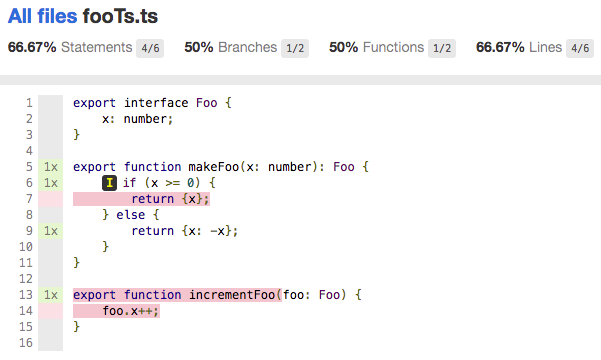

This repository exists to demonstrate an issue with NYC's source code highlighting in Typescript code. 
 
Run the tests with coverage with this command:

```nyc mocha test/**/*.ts```

The files `src/fooTs.ts` and `src/fooTsx.tsx` contain the same contents. The only difference is the filename The corresponding tests in the `test` directory are also identical. Despite that, the coverage report output by NYC differs for the two files (see below). The coverage for `fooTs.ts` looks accurate, but the lines highlighted in `fooTsx.tsx` are not.



